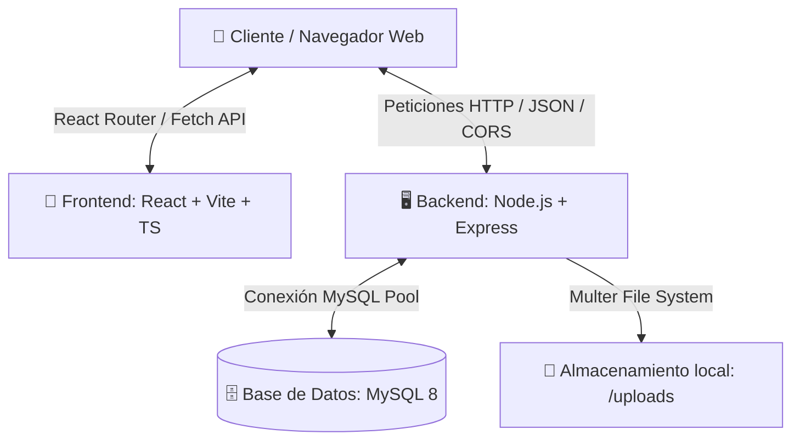

# 🐝 MeliHub - Apiario México

Una aplicación web completa y moderna diseñada para conectar a productores apícolas (en especial de abejas meliponas de la Península de Yucatán y el sureste de México) con clientes interesados. El sistema cuenta con un mapa interactivo, sistema de roles (Apicultor y Cliente), gestión de catálogo de productos, estadísticas de interacción (clics y visitas) y subida de imágenes en tiempo real.

---

## 🏗️ Arquitectura del Sistema

El proyecto está diseñado bajo una arquitectura de **desacoplamiento completo (Decoupled Architecture)**:



* **Frontend**: React 18, TypeScript, Tailwind CSS, Leaflet Maps, Lucide Icons, Sonner (Toasts).
* **Backend**: Node.js, Express, Multer (Subida de fotos), Bcrypt.js (Encriptación).
* **Base de Datos**: MySQL 8.

---

## 📋 Requisitos Previos

Antes de comenzar, asegúrate de tener instalado:
* **Node.js**: Versión `18.x` o superior.
* **NPM**: Versión `9.x` o superior.
* **MySQL Server**: Versión `8.0` o superior (puede ser a través de XAMPP, MAMP o standalone).
* **Docker / Docker Compose**: *(Opcional, solo si deseas desplegar en contenedores)*.

---

## 🚀 Guía de Instalación Paso a Paso

### 1. Base de Datos (MySQL)

1. Abre tu gestor de base de datos MySQL (phpMyAdmin, DBeaver, MySQL Workbench o consola).
2. Asegúrate de que el servidor MySQL esté **encendido** (en puerto `3306` por defecto).
3. El script creará la base de datos `abejas_meliponas` de manera automática al ejecutar la migración. Si deseas hacer la creación manual, ejecuta:
   ```sql
   CREATE DATABASE abejas_meliponas;
   ```

### 2. Configurar y Ejecutar el Backend (Servidor)

Navega a la carpeta del backend, instala las dependencias y realiza las migraciones iniciales:

```bash
# 1. Entrar a la carpeta del backend
cd backend

# 2. Instalar dependencias necesarias
npm install

# 3. Crear el archivo de configuración .env
# Copia el archivo de ejemplo y rellena los datos de tu servidor MySQL
cp .env.example .env
```

#### Configurar el archivo `.env` del Backend:
Abre el archivo `backend/.env` y edita las siguientes variables con tus credenciales:
```env
DB_HOST=localhost       # Dirección del servidor de Base de Datos
DB_USER=root            # Tu usuario de MySQL
DB_PASSWORD=tu_password # Tu contraseña de MySQL (vacío en XAMPP por defecto)
DB_NAME=abejas_meliponas# Nombre de la Base de Datos
PORT=5001               # Puerto donde correrá el backend
```

#### 📧 Configuración de Correo para Recuperación de Contraseña (SMTP):
Para habilitar el envío de correos reales cuando un usuario olvida su contraseña, añade y configura las siguientes variables en tu archivo `backend/.env`:
```env
SMTP_HOST=smtp.gmail.com
SMTP_PORT=587
SMTP_USER=tu-correo@gmail.com
SMTP_PASS=tu-contraseña-de-aplicacion
SMTP_FROM="Soporte MeliHub" <tu-correo@gmail.com>
```
> [!TIP]
> **Modo de Prueba Local (Sin configurar SMTP):** Si dejas las variables `SMTP_USER` y `SMTP_PASS` vacías, el sistema no fallará. En su lugar, simulará el envío e imprimirá el código de seguridad de 6 dígitos directamente en la terminal de Node.js donde se está ejecutando el backend. De esta forma puedes copiar el código e ingresarlo en la app para probar el flujo sin configuraciones previas.

#### Ejecutar Migraciones y Poblado de Datos (Seeders):
Para crear las tablas y rellenar la base de datos con apiarios de prueba:
```bash
# 4. Crear tablas automáticamente en la DB
npm run db:migrate

# 5. Rellenar con información de demostración (Apiarios demo)
npm run db:seed

# 6. Iniciar el servidor backend en modo desarrollo
npm start
```
*Si todo está bien, verás el mensaje: `Server is running on port 5001` y `Connecting to MySQL...`.*

---

### 3. Configurar y Ejecutar el Frontend (Cliente)

Abre una **nueva terminal** en la raíz del proyecto para levantar la interfaz de usuario:

```bash
# 1. Instalar dependencias del frontend
npm install

# 2. Iniciar el servidor local de desarrollo
npm run dev
```
*La aplicación frontend se levantará por defecto en `http://localhost:5173`.*

---

## 📶 📱 Configuración para Red Local (Varios Dispositivos)

Si deseas probar la aplicación en tu **celular, tablet u otra computadora** conectada al mismo Wi-Fi:

> [!WARNING]
> Si dejas el código apuntando a `localhost`, tu teléfono celular intentará conectarse a sí mismo en lugar de conectarse a la computadora donde corre el servidor, marcando un error de conexión (`Network Error` o `Failed to fetch`).

### Paso 1: Obtener tu IP Local
Abre una terminal en tu computadora y averigua tu dirección IP local en la red Wi-Fi:
* **macOS / Linux**: Ejecuta `ifconfig` (busca `inet` en `en0` o similar, p. ej. `192.168.1.75`).
* **Windows**: Ejecuta `ipconfig` en el CMD (busca `Dirección IPv4`, p. ej. `192.168.1.75`).

### Paso 2: Crear el archivo `.env` en el Frontend
Crea un archivo `.env` en la **raíz de la carpeta del proyecto** (donde está el `package.json` principal) y añade la variable `VITE_API_URL` apuntando a la IP de tu computadora:

```env
VITE_API_URL=http://192.168.1.75:5001
```
*(Sustituye `192.168.1.75` por tu IP local real).*

### Paso 3: Iniciar Frontend en modo red
Para permitir que otros dispositivos en tu red local entren a ver la aplicación:
```bash
npm run dev -- --host
```
Vite te mostrará un enlace tipo `http://192.168.1.75:5173`. ¡Abre ese enlace en el navegador de tu celular y todo se conectará perfectamente!

---

## 🐳 Despliegue con Docker y Docker Compose

El proyecto está completamente contenerizado y listo para ejecutarse de forma rápida usando Docker.

### Pasos para levantar con Docker:

1. **Configurar variables de entorno**:
   Copia el archivo `.env.example` en la raíz del proyecto a `.env`:
   ```bash
   cp .env.example .env
   ```
   *(Asegúrate de ajustar las credenciales de base de datos, `VITE_API_URL` y `FRONTEND_URL` en `.env` si es necesario).*

2. **Iniciar los servicios**:
   Desde la raíz del proyecto, ejecuta:
   ```bash
   docker compose up --build -d
   ```
   Esto compilará y levantará:
   * **Base de datos (MySQL 8)**: expuesta en `127.0.0.1:3306` (por seguridad).
   * **Backend (Node.js/Express)**: expuesto en `127.0.0.1:5001` (por seguridad).
   * **Frontend (React/Vite/Nginx)**: expuesto en el puerto `80`.

3. **Ejecutar migraciones y semilla (seeders)**:
   Una vez que los contenedores estén activos y saludables, ejecuta las migraciones y seeders para cargar datos de prueba:
   ```bash
   docker exec -it melihub-backend npm run db:migrate
   docker exec -it melihub-backend npm run db:seed
   ```
   
4. **Acceder a la aplicación**:
   Ingresa a [http://localhost](http://localhost) en tu navegador web.

---

## 🛠️ Solución de Problemas Frecuentes (Troubleshooting)

### ❌ Error: `ECONNREFUSED 127.0.0.1:3306` (o similar) al iniciar el backend
* **Causa**: El backend no puede establecer la conexión con la base de datos MySQL.
* **Solución**: 
  - **Desarrollo local (sin Docker)**: Asegúrate de que tu servidor MySQL local (XAMPP, MAMP o nativo) esté encendido y que las credenciales en `backend/.env` coincidan exactamente con tu base de datos local (generalmente `localhost`).
  - **Despliegue con Docker**: Verifica que en tu archivo `.env` en la raíz del proyecto la variable `DB_HOST` esté configurada como `db` (el nombre del servicio en Docker Compose) y no como `localhost`. Asimismo, valida que no tengas otra instancia de MySQL corriendo en tu host que entre en conflicto.

### ❌ Las imágenes de los apiarios o perfil no cargan (marcan error 404 o rotas)
* **Causa**: Las imágenes se guardan de manera persistente en la carpeta de subidas. Si no se configura correctamente la URL base del backend, las imágenes no se resolverán.
* **Solución**:
  - Verifica que la carpeta `backend/uploads/` (o el volumen montado en el contenedor en `/usr/src/app/uploads`) tenga permisos de escritura.
  - Asegúrate de configurar la variable `BACKEND_URL` en tu archivo de configuración `.env` (en la raíz si usas Docker, o en `backend/.env` si usas desarrollo local) apuntando a la IP o dominio público del backend (ej: `BACKEND_URL=http://192.168.1.75:5001`).

### ❌ Error `Failed to fetch` o pantalla en blanco al entrar desde el móvil
* **Causa**: El frontend no está logrando comunicarse con la API de Express (el backend).
* **Solución**:
  1. Asegúrate de haber completado la sección de [Configuración para Red Local](#-configuración-para-red-local-varios-dispositivos).
  2. Revisa que tu computadora y tu celular estén conectados exactamente al **módem / red Wi-Fi**.
  3. Verifica que tu firewall (como el de Windows o macOS) no esté bloqueando las conexiones entrantes al puerto `5001` de Node.

---
Desarrollado con 🐝 para potenciar el comercio justo y sustentable de las abejas meliponas en México.
